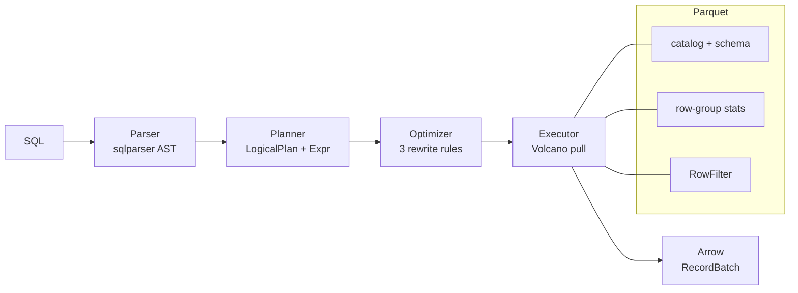

<div align="center">

# Arbor

**A columnar SQL engine over Parquet, written in Rust.**

Hand-written planner · rule-based optimizer · Volcano executor · Apache Arrow batches  
**No DataFusion. No Polars. No query-engine crate in the middle.**

[](https://github.com/yxshwanth/arbor/actions/workflows/ci.yml)
[](LICENSE)
[](https://www.rust-lang.org/)
[](https://arrow.apache.org/)

```
parse → plan → optimize → execute → RecordBatch
```

</div>

---

| | | | |
|:---:|:---:|:---:|:---:|
| **1.85 ms** | **89%** | **44×** | **179 ms** |
| TPC-H–style Q6 @ 900k rows | row groups skipped on that scan | Q1 @ 5k rows after hoisting eval | Q1 @ 900k rows, grouped + sort |

Laptop-class Apple silicon, Criterion `--quick`. Synthetic `lineitem`, not official TPC-H data. Q6 keeps **12 / 110** row groups.

---

## Why it exists

Most “SQL in Rust” demos `use datafusion`. Arbor does the opposite: **own the pipeline**. Parser, logical plan, three rewrite rules, physical operators, expression eval, hash join, hash aggregate, Parquet scan with statistics — all in-tree.

Runtime dependencies are exactly four crates that are *not* a query engine:

| Crate | Role |
|-------|------|
| `sqlparser` | SQL text → AST |
| `arrow` | in-memory columns, compute kernels, pretty-print |
| `parquet` | file footer, page decode, `ProjectionMask`, `RowFilter` |
| `thiserror` | `ArborError` |

`chrono = "=0.4.38"` is pinned so Arrow 51’s `arrow-arith` compiles. Dev: `criterion`, `tempfile`. Batch size is **8192** everywhere.

---

## Pipeline



A `Filter` sitting on a `Scan` is **fused** into `ScanExec`: min/max statistics drop row groups that cannot match, then the predicate runs inside `ParquetRecordBatchReaderBuilder` as a `RowFilter`. The executor never sees SQL strings; the planner never opens a Parquet file.

**Physical operators**

| Operator | What it does |
|----------|----------------|
| `ScanExec` | projection mask, row-group prune, `RowFilter`, schema remap |
| `FilterExec` | boolean mask via Arrow compute (joins and non-scan filters) |
| `ProjectionExec` | evaluate expressions, rename |
| `HashJoinExec` | inner equi-join; keys evaluated **once** per side, then probed |
| `HashAggregateExec` | `SUM` / `COUNT` / `AVG` / `MIN` / `MAX`, grouped or global |
| `SortExec` | full-materialize sort |
| `LimitExec` | stop after *n* rows |
| `EmptyExec` | constant-false plans after folding |

---

## Try it

```bash
git clone https://github.com/yxshwanth/arbor.git
cd arbor
# drop *.parquet into data/  —  stem is the table name (users.parquet → users)
cargo run --release -- "SELECT name, age FROM users WHERE age > 50 ORDER BY age DESC LIMIT 10"
```

REPL: `cargo run --release`, then type SQL at `>`. `exit` / `quit` to leave.

```bash
cargo run --release -- --explain "SELECT city, COUNT(*) FROM users GROUP BY city"
```

prints the logical plan before and after optimize. Traces:

| Env | Effect |
|-----|--------|
| `ARBOR_OPTIMIZER_TRACE` | each rewrite rule on stderr |
| `ARBOR_SCAN_TRACE` | `kept k/n row groups (p% skipped)` |

---

## SQL that actually runs

```sql
-- scan + filter + project
SELECT name, age FROM users WHERE age > 50;

-- global aggregate
SELECT SUM(amount), COUNT(*) FROM orders;

-- grouped aggregate
SELECT city, COUNT(*), AVG(age) FROM users GROUP BY city;

-- equi-join (aliases required in JOIN chains)
SELECT u.name, o.amount
FROM users u
JOIN orders o ON u.id = o.user_id
WHERE o.amount > 100.0;

-- join + group + sort + limit
SELECT u.city, SUM(o.amount) AS total
FROM users u
JOIN orders o ON u.id = o.user_id
GROUP BY u.city
ORDER BY total DESC
LIMIT 5;
```

TPC-H–shaped queries used in the benches (dates are `Int64` in the synthetic file):

```sql
-- Q6: selective scan + global SUM
SELECT SUM(l_extendedprice * l_discount) AS revenue
FROM lineitem
WHERE l_shipdate >= 8000 AND l_shipdate < 8600
  AND l_discount >= 0.05 AND l_discount <= 0.07
  AND l_quantity < 24.0;

-- Q1: grouped aggregates + sort
SELECT l_returnflag, l_linestatus,
  SUM(l_quantity) AS sum_qty,
  SUM(l_extendedprice) AS sum_base_price,
  SUM(l_extendedprice * (1.0 - l_discount)) AS sum_disc_price,
  SUM(l_extendedprice * (1.0 - l_discount) * (1.0 + l_tax)) AS sum_charge,
  AVG(l_quantity) AS avg_qty,
  AVG(l_extendedprice) AS avg_price,
  AVG(l_discount) AS avg_disc,
  COUNT(*) AS count_order
FROM lineitem_q1
WHERE l_shipdate <= 10500
GROUP BY l_returnflag, l_linestatus
ORDER BY l_returnflag, l_linestatus;
```

**Dialect (today)**

| | Supported | Not (yet) |
|--|-----------|-----------|
| Shape | `SELECT` only | `INSERT`, `WITH`, DDL, transactions |
| Join | Inner equi-join, `AND` of equalities | Outer join at execution, non-equi |
| Agg | `SUM`, `COUNT`, `COUNT(*)`, `AVG`, `MIN`, `MAX` + `GROUP BY` | `HAVING`, `DISTINCT` |
| Rest | `WHERE`, `ORDER BY`, `LIMIT`, table aliases, `u.id` | Subqueries, set ops, `CAST` |
| Types | Int64, Float64, Utf8, Boolean, NULL | Timestamps as first-class SQL dates |

Literal types must match Arrow: `24.0` not `24` against a float column; `1.0 - discount` not `1 - discount`.

---

## Scan path: the part that looks like an engine

Q6 on 900k clustered `l_shipdate` rows, 8192-row groups:

```
row groups  0 ──────── 110
decoded     .............████████████.................................
            54          65
            12 kept · 98 skipped · 89.1%
```

Three layers, in order:

1. **Column projection** — `ProjectionMask::leaves` so unused columns are never decoded.
2. **Row-group pruning** — compare `col op literal` (and `AND`/`OR` trees) against Parquet min/max. Unknown conjuncts are conservative: the group is kept.
3. **`RowFilter`** — remaining predicate as `ArrowPredicateFn` over the predicate columns only.

Logical `Filter(Scan)` becomes one physical operator. Filters above joins still go through `FilterExec`.

---

## Optimizer

Three rules, always in this order:

| # | Rule | What it does |
|---|------|----------------|
| 1 | **Predicate pushdown** | Slide `WHERE` toward scans; split join filters to left/right when columns allow; rewrite filters through projections |
| 2 | **Projection pruning** | Narrow scan column lists to what parents actually need; drop identity projections |
| 3 | **Constant folding** | Fold literals; drop always-true filters; replace always-false with `Empty` |

Always-true `WHERE 1 = 1` disappears. Always-false becomes an empty plan with the same schema — no scan.

---

## Numbers

Expression evaluation used to run **inside the per-row loop** on joins and grouped aggregates: each `evaluate_expr` built an N-element array and threw away all but one slot → **O(N²K)**. Keys and aggregate arguments are now evaluated once per batch.

| Workload | Rows | Before | After | Notes |
|----------|------|--------|-------|--------|
| Q1 grouped agg + sort | 5,000 | **52.2 ms** | **1.19 ms** | ~44×; this is the hoist |
| Q1 grouped agg + sort | 900,000 | — | **179 ms** | same scale as Q6; 5.0 M rows/s |
| Q6 scan + filter + `SUM` | 900,000 | — | **1.85 ms** | optimizer on; **487 M rows/s** |
| Q6 row groups | 900,000 | 110 decoded | **12 decoded** | **89.1%** skipped |

```
Q1 @ 5k rows (optimizer on)

  52.2 ms  ████████████████████████████████████████████  before hoist
   1.19 ms █                                             after
```

Reproduce:

```bash
cargo bench --bench tpch_q6 -- --quick
cargo bench --bench tpch_q1 -- --quick
```

Generator: monotonic `l_shipdate`, `WriterProperties::max_row_group_size = 8192`, in `benches/tpch_shared.rs`.

---

## Library

```rust
use std::path::Path;
use arbor::{executor, optimizer, parser, planner, storage};

fn run(sql: &str) -> arbor::error::Result<Vec<arrow::array::RecordBatch>> {
    let data = Path::new("data");
    let catalog = storage::build_catalog(data)?;
    let stmt = parser::parse_sql(sql)?;
    let plan = optimizer::optimize(planner::plan_query(&stmt, &catalog)?)?;
    let mut phys = executor::create_physical_plan(&plan, data)?;
    executor::collect(&mut *phys)
}
```

Public modules: `error`, `parser`, `planner`, `optimizer`, `executor`, `storage`, `types`.  
`cargo doc --no-deps --open` — CI fails on missing docs (`#![warn(missing_docs)]` + `RUSTDOCFLAGS='-D warnings'`).

Layering that is actually enforced:

```
parser  ─► AST only
planner ─► LogicalPlan / Expr     (no Parquet I/O)
optimizer ► LogicalPlan in, LogicalPlan out
executor ► operators + Arrow      (no SQL strings)
storage  ► catalog, file schema
```

Library code returns `Result<T, ArborError>` — `Parse`, `Plan`, `Execution`, `Storage`, `Type`. No `.unwrap()` / `.expect()` on the query path.

---

## Layout

```
├── src/
│   ├── parser/          SQL → AST
│   ├── planner/         AST → LogicalPlan
│   ├── optimizer/       pushdown, prune, fold
│   ├── executor/        Volcano operators, expr eval, scan pushdown
│   ├── storage/         Parquet catalog
│   ├── types.rs         Schema, ScalarValue
│   ├── error.rs
│   ├── lib.rs
│   └── main.rs          CLI + REPL
├── tests/               integration + optimizer
├── benches/             tpch_q1, tpch_q6
└── data/                your parquet (file stem = table)
```

~5k lines of Rust. 22 tests in `cargo test` (unit + integration + optimizer). CI: `fmt`, `clippy -D warnings`, `test`, `doc`.

```bash
cargo test
cargo clippy --all-targets -- -D warnings
RUSTDOCFLAGS='-D warnings' cargo doc --no-deps
```

---

## What it is not

A warehouse. A Postgres. A DataFusion replacement. Outer joins, subqueries, `HAVING`, `DISTINCT`, cost-based search, and a type system beyond the four Arrow types above are out of scope on purpose. The point is a **complete, readable, measurable** planner → executor path you can hold in your head.

---

Apache-2.0. See [LICENSE](LICENSE).
